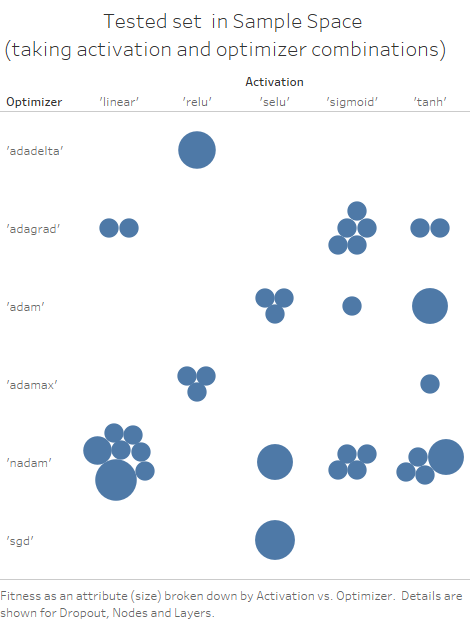

# GeneticsInspiredNeuralNetworkTuning

## Introduction:

The first analysis for optimizing neural network is done using evolutionary genetics. 
Search space consists of 5 hyper-parameters: activation functions, optimizers, hidden layers, nodes in hidden layers and dropout.

Seven activation functions included are: sigmoid, elu, selu, relu, tanh, hard_sigmoid, linear. 
In addition to this, optimizers include sgd, rmsprop, adagrad, adadelta, adam, adamax, nadam. 
Hidden layers range from 1-20.
Nodes/neurons range from 32-1024.
Dropouts range from 0.1 to 0.5.

Using genetic algorithm, the networks are initialized using random sets of configuration variables. These networks then exchange hyper-parameters with each others(a.k.a. crossover). The networks get the change to mutate @2%. This process is called as breeding. The process repeats for generations. In this case, only 10 generations could be run due to memory constraints.

## Requirements:

1. Server: Scientific Linux release 7.5 (Nitrogen)
2. conda 4.5.10
3. Python 2.7.15 :: Anaconda, Inc.
4. numpy 1.15.0
5. Keras 2.2.2
6. Tensorflow 1.5
7. Mpi4py 2.0.0
8. gcc: gcc (GCC) 4.8.5 20150623 (Red Hat 4.8.5-28)
9. ld: ldd (GNU libc) 2.17

## Usage:
    python snnt.py
This saves the output in a log file.

A quick crossstab of the tested combinations of hyper-parameters is shown below. The crosstab suggests that while evaluating hyper-parameter combinations for training out of 7 activation functions, hard_sigmoid and elu couldn't come in any set of combinations for the 7 networks, in any of the 10 generations.  
